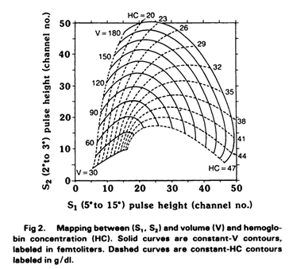

# MieScatteringMax

C# for [Mie Scattering](https://en.wikipedia.org/wiki/Mie_scattering)

---

## Mie theory S1 and S2 vs Volume and HC

---

## MATLAB Functions for Mie Scattering and Absorption
PDF reference is [here](Maetzler2002.pdf).

